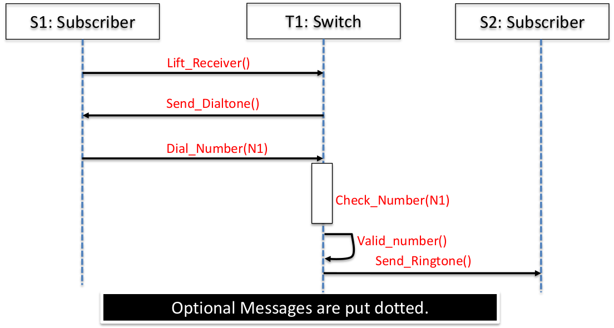
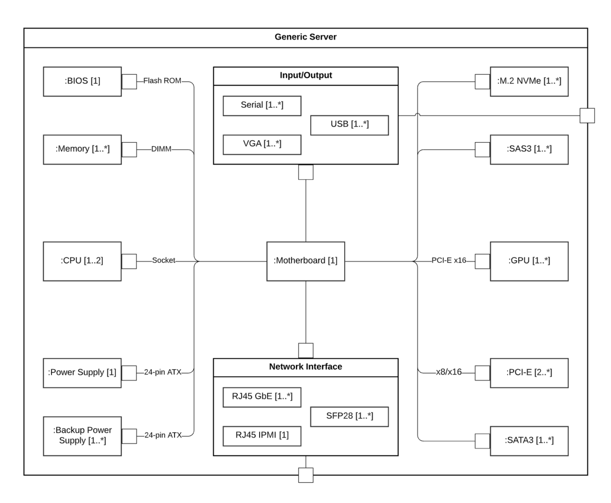

# UML Notes

## Use case diagrams
- shows a set of use cases and actors and their relationships
- represent system functionality and requirements from _user's perspective_
- emphasise "what" not "how"
- Actors
  - Objects that provide or receive information from the system
- Use case
  - A set of actions that the system performs that yields an observable value to an actor
  - Begins with a verb
  - Sufficient granularity to make the use case, useful
- Misuse cases
  - Adversarial scenarios: abusing system functionality, malfunctioning, hacking
	- Threaten/prevent

## Sequence diagrams
- shows "how" an action is performed in what order
- complements a use case with the workflow of events
- Component symbols: lifeline/activation box/option loop/alternative
- Message symbols: sync/async messages
- Lifeline
  - placed across the top of the diagram
  - represent either roles *or* object instances
- Activation box
  - represents the time needed for an object to complete a task
  - longer the task, longer the activation box
- Messages
  - draw an arrow to the receiving object
  - solid arrowhead: synchronous call
  - stick arrowhead: asynchronous
  - on the same lifeline, a higher message precedes a lower message
  - message sending precedes message receiving
- Alternatives
  - If certain conditions are met, a different sequences of events may occur
  - represented by a box around the events
- Loops
  - conditional statement at the top
  - represented by a box around the events
- Timeout
  - incorporated if certain messages occur only after a specific time interval is elapsed
  - arrow pointing to itself (stays within the same object)
- Parallel messages
  - Combine two diagrams, the difference in messages/sequences are boxed in `Par`

## Class diagram
- depicts a set of classes, interfaces, and collaborations and their relationships
- frequently used while modelling object-oriented systems
- components: class name, class attribute list, class operations list
- Relationships:
  - association, implies a multiplicity relationship x..y (x to y, inclusive)
  - inheritance
  - realisation/implementation
  - dependency
  - aggregation, implies that source object is part of a target
  - composition

## State machine diagram
- shows the states that a system goes through during its lifetime
- start/end at initial/final states
- transitions, denoted by lines with arrowheads, with a description of the action/effect/trigger
- actions, the trigger or the "effect" that results in transition (e.g. onEntry, onExit operations)
  - self-looping actions, actions that start and return to the same state (waiting for some event, time delay etc.)
- concurrent states, to perform many activities at the same time. this effectively has two state machine diagrams in parallel
- compound states, where a state machine diagram includes sub-machine diagrams (within the a state)

## Composite structure diagrams

- overview of entire system, broken down into parts
- components:
  - terminator, start and end points
  - node, events or milestones, contain numbers
  - actor, externally interacts with the system
  - class, from the Class Diagram, objects with common properties or behaviours
  - part, a runtime instance of classes or interfaces
  - port, interaction point between an object/instance and its environment
  - interface, specifies behaviours that the implementor agrees to meet
  - connector, lines that show communication/relationships between parts

The main difference between a composite structure diagram and a class diagram, is that this contains more specific detail about a certain object. They show the internal structure of multiple classes and the relationships betweent them in one diagram.