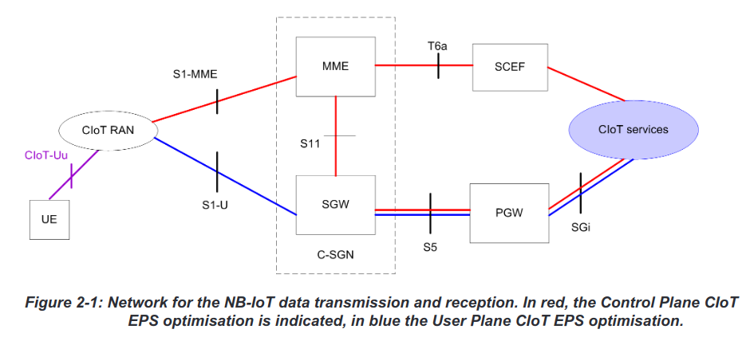
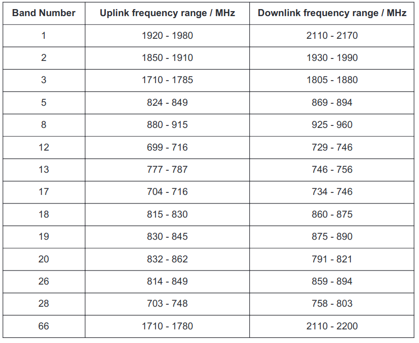
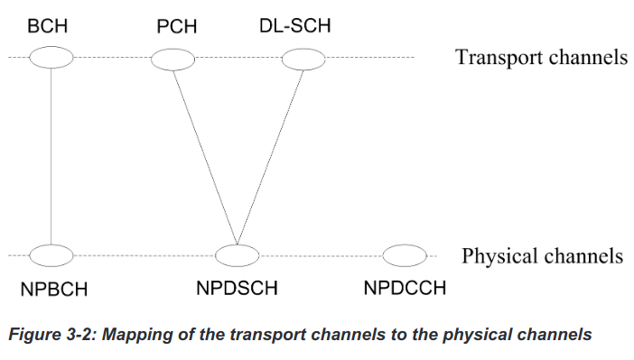

# NB-IoT Specification

## Overview
- machine type communication
- minimise signalling overhead
- improve battery life

## Network

The frequency bands available are shown here, using 180kHz bandwidth, corresponding to one resource block in LTE transmission:

## Physical layer
There are three possible modes of operation: in-band (middle of LTE spectrum), guard band (end of LTE spectrum) and standalone. 

Downlink uses these physical channels:
- NPBCH, the narrowband physical broadcast channel
- NPDCCH, the narrowband physical downlink control channel
- NPDSCH, the narrowband physical downlink shared channel

and these physical signals:
- NRS, Narrowband Reference Signal
- NPSS and NSSS, Primary and Secondary Synchronization Signals

The connections are shown below:

